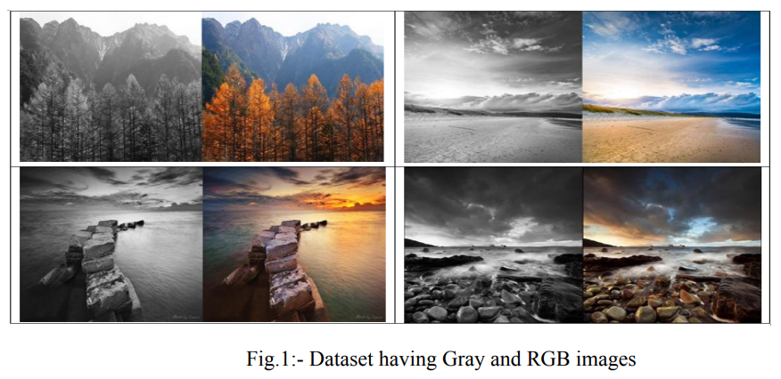
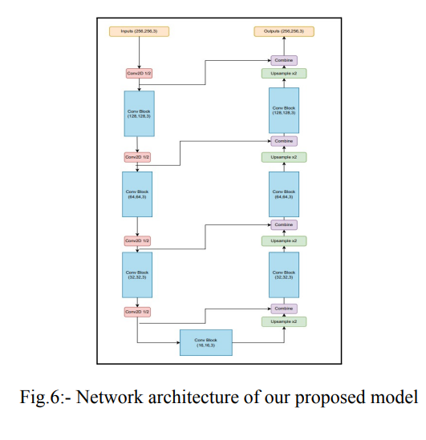
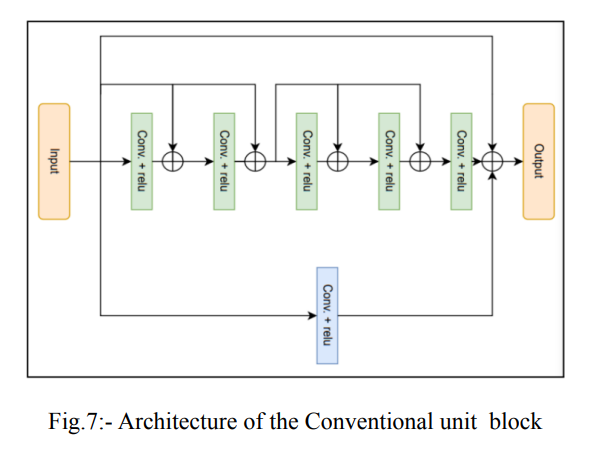
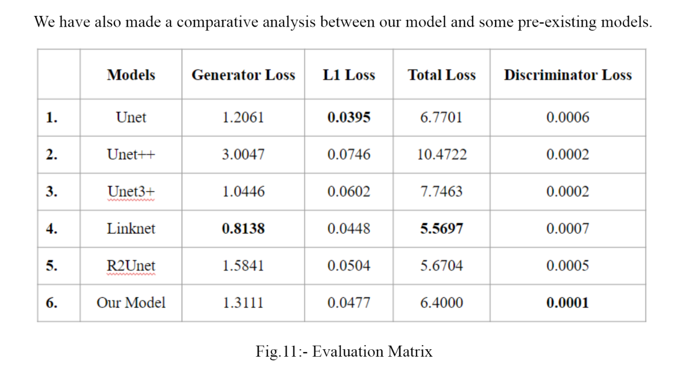
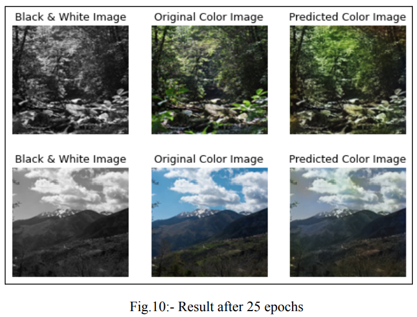

# Image Colorization 
## Overview
The Image Colorization project aims to automatically convert black and white images to their corresponding colored versions using deep learning techniques. The project uses a combination of popular architectures like U-Net, U-Net++, Unet3+, Linknet, R2Unet, and a custom model for the generator. The PatchGAN architecture is employed for the discriminator. The dataset consists of 1000 colored scenery images, which were transformed into black and white images and then combined with the corresponding colored images to create the input-output pairs for training.

## Dataset
The dataset consists of 1000 colored scenery images. To create the input-output pairs for training the colorization model, each colored image is converted into a black and white version, resulting in images of size 256x256 pixels. These black and white images are then concatenated with their corresponding colored images side by side, resulting in images of size 256x512 pixels.

## Generator Models
The project uses several state-of-the-art generator models to perform colorization:

1. U-Net: U-Net is a widely used architecture for image-to-image translation tasks, known for its ability to capture both high and low-level features.

2. U-Net++: U-Net++ is an extension of the U-Net architecture that further improves feature extraction capabilities by adding nested skip connections.

3. Unet3+: Unet3+ is another variant of U-Net, designed to enhance segmentation and colorization tasks by incorporating auxiliary paths in the encoder and decoder.

4. Linknet: Linknet is a lightweight and efficient architecture that utilizes skip connections to improve information flow between the encoder and decoder.

5. R2Unet: R2Unet is a modification of the U-Net architecture, featuring residual connections for more stable and faster training.

6. Custom Model: A custom-designed generator model, tailored to the specific requirements of the colorization task.
## Custom Generator

#### Convolution Unit Block

## Discriminator Model
The PatchGAN architecture is employed for the discriminator. PatchGAN is a variant of the traditional GAN discriminator that classifies small image patches instead of the entire image, leading to more detailed and realistic results.

## Training and Evaluation
The models are trained on the input-output pairs using an adversarial training approach. The generator aims to produce realistic colored versions of the black and white images, while the discriminator aims to differentiate between real colored images and the generated ones. The training is performed iteratively, and the models are evaluated based on metrics like .

## Results

## Future Directions
The Image Colorization project could be extended in the following ways:

1. Exploring other generator and discriminator architectures to improve the colorization results and generate more visually appealing images.
2. Augmenting the dataset with a larger and more diverse set of colored scenery images to further enhance the model's generalization capabilities.
3. Implementing progressive growing techniques to gradually increase the image resolution during training, leading to higher-quality colorization results.
## Conclusion
The Image Colorization project demonstrates the successful application of deep learning techniques for automatic black and white image colorization. By utilizing a combination of popular generator models and the PatchGAN discriminator, the project achieves impressive results in converting black and white scenery images to their corresponding colored versions. The developed models have the potential to be used in various applications, including image restoration, art enhancement, and creative content generation.

## Contributors
1. Rajeev Ranjan
2. Kshitij Kumar
